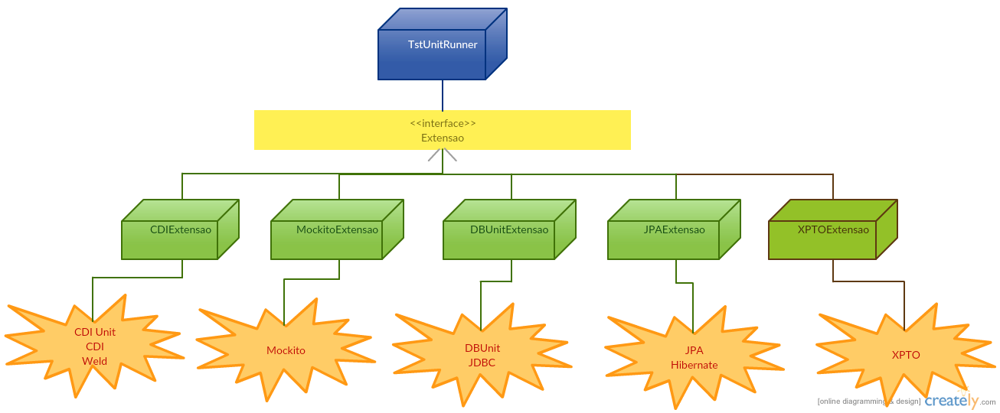

TST Unit
==============================


Biblioteca que auxilia no desenvolvimento de testes unitários e de integração.

---

Histórico de mudanças
----------

**??? - 1.6.0**
- ![Melhoria][melhoria] _[TST Unit JAX-RS]_ Toda a API que encapsulava a biblioteca de manipulação de JSON utilizada (_Jackson_, _Gson_, etc) está agora `@Deprecated`. Delegando para o código cliente a forma de converter objetos Java em JSON e vice-versa.

**18/07/2017 - 1.5.0**
- ![Bug][bug] _[TST Unit DbUnit]_ Testes utilizando outros bancos que não H2 ainda estavam rodando código específico para o H2.
- ![Melhoria][melhoria] _[TST Unit DbUnit]_ Alterando anotação `@UsarDataSet` para suportar múltiplos valores e também customizar a operação a ser executada.
- ![Melhoria][melhoria] _[TST Unit DbUnit]_ Agora é possível utilizar as anotações `@RodarScriptAntes` e `@RodarScriptDepois` em outros bancos que não H2.
- ![Novo][novo] _[TST Unit JAX-RS]_ Adicionando suporte ao _Gson_.
- ![Novo][novo] _[TST Unit Core]_ Criando a funcionalidade de medir o tempo de execução gasto em cada uma das etapas do teste.

**03/05/2017 - 1.4.0**
- ![Bug][bug] _[TST Unit CDI]_ Alterando versão do _CDI Unit_ de 2.2.1 para 3.1.3 devido a problemas surgidos no desenvolvimento dos testes.
- ![Novo][novo] _[TST Unit JAX-RS]_ Criação do módulo. 

**27/03/2017 - 1.3.1**
- ![Bug][bug] _[TST Unit Core]_ Corrigindo `NullPointerException` quando utilizava uma extensão que necessita do arquivo `tstunit.properties` sem esse arquivo existir.
- ![Bug][bug] _[TST Unit DBUnit]_ A propriedade `dbunit.dataTypeFactoryClass` estava obrigatória ao invés de opcional.
- ![Bug][bug] _[TST Unit CDI]_ Alterando versão do _CDI Unit_ de 3.1.3 para 2.2.1 para melhor se adequar à realidade do TST.

**22/11/2016 - 1.3.0**
- ![Melhoria][melhoria] _[TST Unit JPA]_ Evitando duplicação de configuração de propriedades do banco de dados caso o teste também utilize o _TST Unit DbUnit_.

**13/10/2016 - 1.2.0**
- ![Melhoria][melhoria] _[TST Unit JPA]_ Adicionando suporte a várias instâncias simultâneas de `EntityManager` nos testes.
- ![Melhoria][melhoria] _[TST Unit JPA]_ Desacoplamento do _CDI_.
- ![Novo][novo] _[TST Unit DBUnit]_ Agora é possível integração com outros bancos que não H2.

**08/09/2016 - 1.1.2**
- ![Bug][bug] _[TST Unit Core]_ Atualizando versão do _Reflections_ para uma estável.
- ![Bug][bug] _[TST Unit CDI]_ Removendo dependência transitiva do _Reflections_ para corrigir bug de `NoSuchMethodError` dentro do _CDI Unit_.

**02/09/2016 - 1.1.1**
- ![Bug][bug] _[TST Unit CDI]_ Correção de bug introduzido na versão anterior que causava falha em testes com dependência circular.

**31/08/2016 - 1.1.0**
- ![Melhoria][melhoria] _[TST Unit DBUnit]_ As anotações `@RodarScriptAntes` e `@RodarScriptDepois` agora aceitam múltiplos arquivos como parâmetro.
- ![Melhoria][melhoria] _[TST Unit DBUnit]_ Parametrizando operações a serem executadas antes e após cada teste - propriedades `dbunit.beforeTests.operation` e `dbunit.afterTests.operation`.
- ![Melhoria][melhoria] _[TST Unit DBUnit]_ Refatoração geral do módulo, que ocasionou mudanças de pacotes das anotações.
- ![Melhoria][melhoria] _[TST Unit JPA]_ O `EntityManager` gerado pela `TestEntityManagerProducer` agora possui o qualificador `@ApplicationScoped`.
- ![Novo][novo] _[todos]_ Adicionando suporte a testes parametrizados.

**19/07/2016 - 1.0.0**
- ![Novo][novo] Primeiro release do projeto.

TODO List
---------

- ![Novo][novo] Permitir utilização de suites de testes
- ![Novo][novo] Integração com JBehave

[bug]: docs/bug.png
[melhoria]: docs/improvement.png
[novo]: docs/new-feature.png

Requisitos
---------

* JDK 8+

Uso
----------

Para utilizar o TST Unit em seu projeto, adicione o módulo abaixo como dependência:

```xml
<dependency>
    <groupId>br.jus.tst</groupId>
    <artifactId>tst-unit-core</artifactId>
    <version>[1.0.0,)</version>
    <scope>test</scope>
</dependency>
```

E então, utilize a classe `TSTUnitRunner` para rodar seus testes:

```java
package br.jus.tst.teste;

@RunWith(TstUnitRunner.class)
public class MinhaClasseTeste {

    @Test
    public void teste() {
        // ...
    }
}
```
Sem mais nenhuma configuração adicional, seu teste passa a contar com alguns recursos básicos, como a impressão dos nomes dos testes que estão rodando:

```
>>>>>>>>>> Executando: br.jus.tst.teste.MinhaClasseTeste.teste <<<<<<<<<<
```

Para utilizar outros recursos, você pode adicionar extensões, que adicionam novas funcionalidades ao TST Unit.

### Customização

O recurso que imprime o nome de cada teste no console pode ser desativado ou customizado através da anotação `@ImprimirNomeTeste`.

O valor padrão, que é utilizado quando nenhuma anotação `@ImprimirNomeTeste` está presente na classe de testes, pode ser configurado através de um arquivo `tstunit.properties` em seu _classpath_:

```
# Desabilita a impressão dos nomes dos testes por padrão
core.printtestname.default=false
```

### Medição do tempo de execução

Existe um recurso que permite visualizar o tempo de execução gasto em cada uma das etapas do teste. Isso é útil principalmente quando seu teste utiliza muitas extensões e o tempo total de execução esteja ficando muito alto.

Para habilitar (e customizar) esse recurso, basta configurar através do arquivo `tstunit.properties`:

```
# Habilita o Medidor de Tempo de Execução
core.medidortempoexecucao.habilitado=true
# Customiza a mensagem que é exibida no console - normalmente não é necessário alterar
# core.medidortempoexecucao.mensagens.formato=\n[TST UNIT - MEDIDOR] %s levou %d milisegundos\n
# Indica se as mensagens devem ser geradas em formato ANSI (com cores, por exemplo)
# core.medidortempoexecucao.consoleansi=true
# Define um tempo (milisegundos) a partir do qual a execução de determinada operação é considerada no nível "alerta"
# core.medidortempoexecucao.duracao.alerta=500
# Define um tempo (milisegundos) a partir do qual a execução de determinada operação é considerada no nível "perigo"
# core.medidortempoexecucao.duracao.perigo=1000
```

Assim, ao executar seus testes, você verá no console informações como:

```
[TST UNIT - MEDIDOR] XXX levou 901 milisegundos

[TST UNIT - MEDIDOR] YYY levou 500 milisegundos

[TST UNIT - MEDIDOR] ZZZ levou 15 milisegundos

```

Caso a propriedade `core.medidortempoexecucao.consoleansi` tenha valor `true`, os valores referentes aos tempos de execução serão impressos com cores para indicar se o tempo ultrapassou os valores definidos como _alerta_ ou _perigo_.

### Utilizando em projetos com versões inferiores ao Java 8

É possível ter um projeto Maven em que o código de produção use uma versão do Java diferente do código dos testes. Para isso, é necessário configurar o `maven-compiler-plugin` conforme abaixo (solução retirada do [StackOverflow](http://stackoverflow.com/a/38743953/3228529)):

```xml
<plugin>
    <groupId>org.apache.maven.plugins</groupId>
    <artifactId>maven-compiler-plugin</artifactId>
    <version>3.5.1</version>
    <configuration>
        <source>1.7</source>
        <target>1.7</target>
        <testSource>1.8</testSource>
        <testTarget>1.8</testTarget>
    </configuration>
</plugin>
```

Neste exemplo, o código de produção utiliza Java 7, enquanto que os testes serão compilados com Java 8.

Ainda assim, caso tente rodar os testes diretamente de sua IDE, pode ser que ela tente utilizar nos testes a versão do Java definida para o projeto. No caso do Eclipse, isso pode ser alterado conforme abaixo:

1. Clicando com o botão direito do mouse sobre o projeto, ir em _Run As > Run Configurations..._.
2. Dentro do item _JUnit_, clicar sobre seu testes.
3. Acessar a aba _JRE_.
4. Marcar _Execution environment_ e selecionar a opção referente ao _JavaSE 1.8_.
5. Salvar e rodar o teste.

### Extensões



As extensões atualmente existentes são:

* _tst-unit-cdi_: habilita o uso de [CDI](http://weld.cdi-spec.org/) nos testes (obs.: como muitas vezes o uso de CDI é feito em conjunto com mocks, o Mockito também já é habilitado por padrão através dessa extensão, não sendo necessário o uso da _tst-unit-mockito_);
* _tst-unit-dbunit_: habilita o uso do [DBUnit](http://dbunit.sourceforge.net/) nos testes;
* _tst-unit-mockito_: habilita o uso do [Mockito](http://mockito.org/) nos testes;
* _tst-unit-jpa_: habilita o uso de JPA nos testes.

Para usar uma extensão, basta adicionar a respectiva dependência ao seu projeto:

```xml
<dependency>
    <groupId>br.jus.tst</groupId>
    <artifactId>tst-unit-dbunit</artifactId>
    <version>[1.0.0,)</version>
    <scope>test</scope>
</dependency>
```

Cada extensão define uma anotação que pode ser incluída em suas classes de testes para ativá-la:

```java
package br.jus.tst.teste;

@RunWith(TstUnitRunner.class)
@HabilitarXxx
public class MinhaClasseTeste {

    @Test
    public void teste() {
        // ...
    }
}
```

#### TST Unit CDI

Habilita o CDI nos testes. Observar que as precondições para funcionamento do CDI devem ser seguidas (como ter um `beans.xml` no seu _classpath_). Por comodidade, essa extensão já habilita o uso do Mockito nos testes. É utilizado o [Weld](http://weld.cdi-spec.org/) como implementação do CDI.

A maior parte do funcionamento é delegado para o [CDI Unit](http://jglue.org/cdi-unit/).

##### Dependência

```xml
<dependency>
    <groupId>br.jus.tst</groupId>
    <artifactId>tst-unit-cdi</artifactId>
    <version>[1.0.0,)</version>
    <scope>test</scope>
</dependency>
```

##### Uso

Além da anotação `@HabilitarCdiAndMockito`, as anotações do CDI Unit podem ser usadas normalmente. Ver [CDI Unit User Guide](http://jglue.org/cdi-unit-user-guide/).

```java
package br.jus.tst.teste;

@RunWith(TstUnitRunner.class)
@HabilitarCdiAndMockito
@AdditionalClasses({ MeuProdutor.class }) // anotação do CDI Unit
public class MinhaClasseTeste {

    @Inject
    private MinhaClasse instancia;
    
    @Produces
    @ProducesAlternative
    @Mock
    private MeuRecursoExterno recurso;

    @Test
    public void teste() {
        // ...
    }
}
```

##### EJBs

A anotação `@EJB` não é automaticamente processada na execução dos testes, uma vez que não há um contêiner de EJBs ativo. Para que a injeção de dependências funcione nesse caso, basta trocar a anotação por `@Inject`, que produz o mesmo efeito.

Outra opção é a solução fornecida pelo _CDI Unit_, através da anotação `@SupportEjb`: [CDI Unit - EJB Support](http://jglue.org/cdi-unit-user-guide/#ejb).

#### TST Unit DBUnit

##### Dependência

```xml
<dependency>
    <groupId>br.jus.tst</groupId>
    <artifactId>tst-unit-dbunit</artifactId>
    <version>[1.0.0,)</version>
    <scope>test</scope>
</dependency>
```

##### Uso

Para utilizar essa extensão, é necessário ter um arquivo `tstunit.properties` em seu _classpath_ (normalmente em `src/test/resources`). O conteúdo desse arquivo deve ter as propriedades abaixo:

```
# Valores obrigatórios:

# Nome da classe de driver SQL a ser utilizada para abrir conexões JDBC
jdbc.driverClass=
# URL do banco de dados
jdbc.url=
# Usuário de banco de dados
jdbc.user=
# Senha do usuário de banco de dados
jdbc.password=

# Valores opcionais:

# Diretório no classpath onde serão buscados os arquivos de dataset
dbunit.datasets.dir=
# Diretório no classpath onde serão buscados os arquivos de script
dbunit.scripts.dir=
# Nome da classe de DataType factory - ver http://dbunit.sourceforge.net/properties.html#DataType_factory
dbunit.dataTypeFactoryClass=
# Operação a ser executada antes de cada teste que utilize DataSets
dbunit.beforeTests.operation=
# Operação a ser executada após cada teste que utilize DataSets
dbunit.afterTests.operation=
```

Notar que as propriedades `dbunit.beforeTests.operation` e `dbunit.afterTests.operation` devem ter como valor o nome de uma das constantes disponíveis em [DatabaseOperation](http://dbunit.sourceforge.net/apidocs/org/dbunit/operation/DatabaseOperation.html). Por padrão, elas possuem os valores `CLEAN_INSERT` e `DELETE_ALL`, respectivamente.

Além da anotação `@HabilitarDbUnit`, existe um outro conjunto de anotações que podem ser úteis para a execução do teste:

* `@RodarScriptAntes`: define um ou mais arquivos de script a serem executados antes de um método de teste ou antes de todos os métodos de teste de uma classe. Por padrão, os arquivos são procurados dentro de um diretório `scripts` no _classpath_. Para maiores detalhes, ver Javadoc da anotação.
* `@RodarScriptDepois`: define um ou mais arquivos de script a serem executados após um método de teste ou após todos os métodos de teste de uma classe. Por padrão, os arquivos são procurados dentro de um diretório `scripts` no _classpath_. Para maiores detalhes, ver Javadoc da anotação.
* `@UsarDataSet`: define um arquivo de _dataset_ do DBUnit a ser utilizado pelo teste. O banco é carregado com os dados definidos no arquivo antes da execução do teste (operação _CLEAN-INSERT_). Por padrão, o arquivo é procurado dentro de um diretório `datasets` no _classpath_. OBS.: Não é possível utilizar simultaneamente esta anotação em um método de teste e em sua classe. Nesse caso, somente será considerada a anotação da classe.

```java
package br.jus.tst.teste;

@RunWith(TstUnitRunner.class)
@HabilitarDbUnit(nomeSchema = "TT")
@RodarScriptAntes("criar-schema.sql")
@RodarScriptDepois("drop-schema.sql")
public class MinhaClasseTeste {

    @Inject
    private MinhaClasse instancia;

    @Test
    @UsarDataSet("meus-dados.xml")
    public void teste() {
        // ...
    }
}
```

##### Múltiplos DataSets

É possível utilizar diversos arquivos de dados do DBUnit nos testes, como no exemplo abaixo:

```java
package br.jus.tst.teste;

@RunWith(TstUnitRunner.class)
@HabilitarDbUnit(nomeSchema = "TT")
@RodarScriptAntes("criar-schema.sql")
@RodarScriptDepois("drop-schema.sql")
@UsarDataSet("meu-dataset-geral.xml")
public class MinhaClasseTeste {

    @Inject
    private MinhaClasse instancia;

    @Test
    @UsarDataSets({
    	@UsarDataSets(value = "meu-dataset-1.xml", operacaoPreTestes = Operacao.INSERT, operacaoPosTestes = Operacao.NONE),
    	@UsarDataSets(value = "meu-dataset-2.xml")
    })
    public void testeMultiplosDatasets() {
        // ...
    }
}
```

Note que são utilizados no total 3 arquivos no teste `testeMultiplosDatasets`: `meu-dataset-geral.xml`, `meu-dataset-1.xml` e `meu-dataset-2.xml`. O comportamento é que os arquivos sejam processados na ordem: arquivos definidos a nível de classe (sequencialmente) -> arquivos definidos a nível de método (sequencialmente).

**Importante:** A anotação `@UsarDataSets` permite que sejam customizadas as operações a serem executadas antes e após cada teste. Caso isso não seja feito, o comportamento padrão define que sejam usadas as operações configuradas no arquivo `tstunit.properties` (ver acima em _Uso_). Isso pode não ser o desejado, visto que, por exemplo, caso a operação pré-testes configurada seja `CLEAN_INSERT`, isso fará com que todas as tabelas referenciadas em cada arquivo de dados sejam apagadas assim que o arquivo for processado. No exemplo acima, o fluxo de execução foi definido da seguinte forma:

1. `CLEAN_INSERT "meu-dataset-geral.xml"` (_default_)
2. `INSERT "meu-dataset-1.xml"` (customizado)
3. `CLEAN_INSERT "meu-dataset-2.xml"`(_default_)
4. `Execução do teste`
4. `DELETE_ALL "meu-dataset-2.xml"` (_default_)
5. `DELETE_ALL "meu-dataset-geral.xml"` (_default_)

##### Gerando DTD

O módulo também fornece um recurso que auxilia na geração de arquivos [DTD](http://www.w3schools.com/xml/xml_dtd.asp) do _schema_ de banco de dados.

Para utilizá-lo, crie uma classe de teste em seu projeto semelhante a essa:

```
@RunWith(TstUnitRunner.class)
@HabilitarDbUnit
public class GeradorDbUnitDtd {

    @Test
    // @Ignore
    @GerarDtd("src/test/resources/datasets/pl.dtd")
    public void gerarDtd() {
    	/* 
    	   Pode ser necessário incluir aqui um assertTrue(true) ou deixar um @Ignore no teste para evitar falsos índices de quantidade de testes de seu 
    	   projeto ou problemas com ferramentas de análise de código, como Sonar.
    	*/
    }
}
```

Lembre-se que o _schema_ de banco de dados precisa estar criado para que possa ser exportado pela ferramenta. Como opções, você pode usar a anotação `@RodarScriptAntes` para executar um arquivo de script que crie o _schema_ ou também tirar proveito da extensão _TST Unit JPA_ - em conjunto com configurações do próprio JPA, é possível delegar para sua implementação de JPA (ex.: Hibernate) a criação do _schema_. Para maiores informações sobre uso do _TST Unit JPA_, veja abaixo.

##### Nota sobre transações

Ao realizar operações de inserção, deleção e atualização em seus testes com JPA/Hibernate, pode ser que você observe-as não sendo efetivadas no banco de dados caso seu código de produção dependa de um gerenciador de transações ativo (o que não existe durante a execução dos testes). Assim, você deverá iniciar e finalizar suas transações manualmente, como no exemplo abaixo, que utiliza CDI (ver _TST Unit JPA_):

```java
    @Inject
    private EntityManager entityManager;

    @Test
    public void meuTeste() {
    	// ...
    	
		try {
			entityManager.getTransaction().begin();
			meuServico.inserir(objeto); // o serviço utiliza o mesmo entityManager internamente
			entityManager.getTransaction().commit();
		} catch (PersistenceException exception) {
			entityManager.getTransaction().rollback();
		}
		
		// ...
	}
```

##### Acessando as conexões diretamente

Caso seja necessário ter acesso direto às conexões utilizadas pelo _TST Unit DBUnit_, você pode fazer conforme o exemplo abaixo:

```java
	try {
	    Configuracao configuracao = new Configuracao().carregar();
	    JdbcConnectionSupplier connectionSupplier = new JdbcConnectionSupplier(configuracao.getSubPropriedades("jdbc"));
	    Connection connection = connectionSupplier.get(); // uma conexão com o banco utilizado pelo TST Unit DBUnit
	} catch (TstUnitException exception) {
	    // TODO Tratar exception
	}
```

#### TST Unit JPA

##### Dependência

```xml
<dependency>
    <groupId>br.jus.tst</groupId>
    <artifactId>tst-unit-jpa</artifactId>
    <version>[1.0.0,)</version>
    <scope>test</scope>
</dependency>
```

##### Uso

Utilize a anotação `@HabilitarJpa` em seus testes:

```java
package br.jus.tst.teste;

@RunWith(TstUnitRunner.class)
@HabilitarJpa(nomeUnidadePersistencia = "meuPU")
public class MinhaClasseTeste {

    private EntityManager em;
    
    @Before
    public void setUp() {
    	// a instância de entityManager criada é singleton
        em = EntityManagerCacheProducer.getUniqueEntityManager().get();
    }

    @Test
    public void teste() {
        // ...
    }
}
```

OBS.: Não é necessário fechar a instância de `EntityManager` fornecida, pois isso será feito internamente após a execução dos seus testes.

##### Integração com outros módulos

É possível usar essa extensão em conjunto com a _TST Unit CDI_, de modo que seus testes ficarão com uma estrutura semelhante à essa:

```java
package br.jus.tst.teste;

@RunWith(TstUnitRunner.class)
@HabilitarCdiAndMockito
@AdditionalClasses({ EntityManagerFactoryProducerExtension.class }) // extensão que habilita os produtores do JPA
@HabilitarJpa(nomeUnidadePersistencia = "meuPU", geradorSchema = GeradorSchemaCdi.class)
public class MinhaClasseTeste {

    // @Inject
    // private EntityManager em;
    @Inject
    private MinhaClasseQueUsaEntityManager instancia;

    @Test
    public void teste() {
        // ...
    }
}
```

Nota sobre `GeradorSchemaCdi`: esta classe tem a função de utilizar a instância de `EntityManager` fornecida pelo contêiner do CDI para gerar o _schema_ de banco de dados. Notar que, para isso, é necessário habilitar a função _ hbm2ddl_ do seu framework ORM (Hibernate).

Caso você queira usar essa extensão em conjunto com a _TST Unit DBUnit_, é possível gerar o _schema_ de banco antes de cada teste:

```java
package br.jus.tst.teste;

@RunWith(TstUnitRunner.class)
@HabilitarCdiAndMockito
@AdditionalClasses({ EntityManagerFactoryProducerExtension.class })
@HabilitarDbUnit
@HabilitarJpa(nomeUnidadePersistencia = "meuPU", geradorSchema = GeradorSchemaCdi.class)
public class MinhaClasseTeste {

    @Inject
    private MinhaClasseQueUsaEntityManager instancia;

    @Test
    @UsarDataSet("meu-dataset.xml")
    public void teste() {
        // ...
    }
}
```

Basta definir a propriedade `hibernate.hbm2ddl.auto` no seu arquivo `persistence.xml` utilizado pelos testes com o valor `create`:

```xml
<persistence-unit name="meuPU">

	...
	
    <properties>
    	...
    	<property name="hibernate.hbm2ddl.auto" value="create" />
       ...
    </properties>
</persistence-unit>
```

OBS.: O valor `create-drop` não é suportado dessa forma pois o JPA irá derrubar o _schema_ assim que o último `EntityManager` for fechado, ocasionando erros na execução do _TST Unit DBUnit_, que irá tentar limpar o banco de dados em seguida.

Para evitar duplicação de configuração de banco de dados (arquivos `persistence.xml` e `tstunit.properties`), é possível utilizar apenas o último, deixando seu `persistence.xml` de testes com uma configuração mínima, conforme exemplo abaixo:

```xml
<persistence-unit name="meuPU" transaction-type="RESOURCE_LOCAL">
	<provider>org.hibernate.jpa.HibernatePersistenceProvider</provider>
	
	<class>br.jus.tst.modelo.MinhaEntidade</class>
</persistence-unit>
```

E no `tstunit.properties`, configurações adicionais a serem repassadas para seu framework ORM podem ser definidas através do prefixo `jpa.orm`:

```
#jdbc.driverClass=
#jdbc.url=
#jdbc.user=
#jdbc.password=

jpa.orm.hibernate.dialect=org.hibernate.dialect.H2Dialect
jpa.orm.hibernate.default_schema=FOO
jpa.orm.hibernate.show_sql=true
jpa.orm.hibernate.format_sql=true
jpa.orm.hibernate.hbm2ddl.auto=create-drop
```

Notar quer as propriedades de conexão JDBC definidas pelo _TST Unit DBUnit_ (prefixo `jdbc`), caso presentes neste arquivo, também serão repassadas para o framework ORM com as devidas alterações de nome/chave.

##### Múltiplas unidades de persistência no mesmo teste

Caso seu teste utilize mais de uma unidade de persistência, o corpo da anotação `@HabilitarJpa` ficará um pouco diferente, conforme o exemplo abaixo:

```java
package br.jus.tst.teste;

@RunWith(TstUnitRunner.class)
@HabilitarJpa(unidadesPersistencia = {
		@UnidadePersistencia(nome = "testePU", qualifierClass = TestePU.class),
        @UnidadePersistencia(nome = "teste2PU", qualifierClass = Teste2PU.class) }, geradorSchema = GeradorSchemaCdi.class)
@HabilitarCdiAndMockito // esse recurso pode ser utilizado com o CDI
@AdditionalClasses({ EntityManagerFactoryProducerExtension.class })
public class MinhaClasseTeste {

    @Inject
    @TestePU
    private EntityManager entityManager1;

    @Inject
    @Teste2PU
    private EntityManager entityManager2;
    
    @Inject
    private MinhaClasseQueUsaEntityManager instancia;

    @Test
    public void teste() {
        // ...
    }
}
```

#### TST Unit Mockito

##### Dependência

```xml
<dependency>
    <groupId>br.jus.tst</groupId>
    <artifactId>tst-unit-mockito</artifactId>
    <version>[1.0.0,)</version>
    <scope>test</scope>
</dependency>
```

##### Uso

```java
package br.jus.tst.teste;

@RunWith(TstUnitRunner.class)
@HabilitarMockito
public class MinhaClasseTeste {

    @Mock
    private MinhaClasse instancia;

    @Test
    public void teste() {
        // ...
    }
}
```

#### TST Unit JAX-RS

##### Dependência

```xml
<dependency>
    <groupId>br.jus.tst</groupId>
    <artifactId>tst-unit-jaxrs</artifactId>
    <version>[1.0.0,)</version>
    <scope>test</scope>
</dependency>
```

##### Uso

Esta extensão funciona em conjunto com a _TST Unit CDI_. Dessa forma, basta incluir alguns itens na anotação `@AdditionalClasses`, além de injetar a instância de `JaxRsEngine`, que fornece acesso a todas as funcionalidades da extensão.

Utilizando RestEasy:

```java
package br.jus.tst.teste;

@RunWith(TstUnitRunner.class)
@HabilitarCdiAndMockito
@AdditionalClasses({ ResteasyCdiExtension.class, ResteasyEngine.class })
public class MinhaClasseTeste {

    @Inject
    @Resteasy
    private JaxRsEngine jaxRsEngine;

    @Test
    public void teste() {
        // jaxRsEngine. ...
    }
}
```

##### Integração com Jackson

Como atualmente o Jackson pode ser encontrado sob dois _groupId_s e pacotes diferentes - `org.codehaus` e `com.fasterxml` - você precisa definir manualmente qual versão deve ser utilizada, caso use esse recurso. Isso pode ser feito através das implementações da interface `JsonToObjectConverter.java`:

```java
package br.jus.tst.teste;

@RunWith(TstUnitRunner.class)
@HabilitarCdiAndMockito
@AdditionalClasses({ ResteasyCdiExtension.class, ResteasyEngine.class })
public class MinhaClasseTeste {

    @Inject
    @Resteasy
    private JaxRsEngine jaxRsEngine;
    
    @Inject
    private ObjectMapper objectMapper;

    @Test
    public void teste() {
        MeuObjeto meuObjeto = jaxRsEngine.get(...).executar().getObjetoRespostaUsando(stream -> objectMapper.readValue(stream, MeuObjeto.class));
        ...
    }
}
```

#### Testes parametrizados

O TST Unit também oferece suporte a testes parametrizados. Para isso, sua classe de teste deve utilizar algumas anotações diferentes:

```java
@RunWith(Parameterized.class)
@UseParametersRunnerFactory(TstUnitParameterizedRunnerFactory.class)
public class MeuTesteParametrizado {

    @Parameters
    public static Collection<Object[]> parametros() {
        return Arrays.asList(new Object[] { 1, "1" }, new Object[] { 2, "2" });
    }

    @Parameter(0)
    public int numero;
    @Parameter(1)
    public String numeroString;

    @Test
    public void teste() {
        assertThat(String.valueOf(numero), is(equalTo(numeroString)));
    }
}
```

Notar que o _runner_ definido em `@RunWith` deve ser o `Parameterized.class`, ao invés de `TstUnitRunner.class`. A outra anotação, `@UseParametersRunnerFactory`, é fornecida pelo próprio JUnit e é utilizada aqui para conectar o _runner_ de testes parametrizados com o _runner_ do TST Unit.

Outras anotações das extensões podem ser utilizadas normalmente:

```java
@RunWith(Parameterized.class)
@UseParametersRunnerFactory(TstUnitParameterizedRunnerFactory.class)
@HabilitarCdiAndMockito
@AdditionalPackages({ TestEntityManagerProducer.class })
@HabilitarJpa(nomeUnidadePersistencia = "meuPU")
public class MeuTesteParametrizado {

    ...

    @Test
    public void teste() {
        ...
    }
}
```

#### Criando novas extensões

Caso seja necessário adicionar uma nova extensão ao TST Unit, basta seguir os passos abaixo:

1. Crie uma anotação para habilitar a extensão nas classes de teste:

```java
package br.jus.tst.minhaextensao;

import static java.lang.annotation.ElementType.TYPE;
import static java.lang.annotation.RetentionPolicy.RUNTIME;

@Target({ TYPE })
@Retention(RUNTIME)
@Inherited
@Documented
public @interface HabilitarMinhaExtensao {

}
```

2. Crie a classe que define a lógica da extensão:

```java
package br.jus.tst.minhaextensao;

import org.junit.runner.notification.RunNotifier;
import org.junit.runners.model.*;

import br.jus.tst.tstunit.*;

public class MinhaExtensao extends AbstractExtensao<HabilitarMinhaExtensao> {

    @Override
    public void inicializar(Configuracao configuracao, RunNotifier notifier) throws TstUnitException {
        // TODO Gerado automaticamente
    }

    @Override
    public Statement criarStatement(Statement defaultStatement, FrameworkMethod method) throws TstUnitException {
        // TODO Gerado automaticamente
        return null;
    }
}
```

Dê uma olhada na API da classe `AbstractExtensao` e da interface `Extensao` para verificar se existe algum método que você possa ter interesse em sobrescrever. Também pode ser útil verificar o código das classes das extensões já existentes, como `CdiExtensao` e `DbUnitExtensao`.

3. Agora a nova extensão já pode ser habilitada nos testes:

```
package br.jus.tst.teste;

@RunWith(TstUnitRunner.class)
@HabilitarMinhaExtensao
public class MinhaClasseTeste {

    @Test
    public void teste() {
        // ...
    }
}
```

#### Problemas conhecidos

##### Javassist

Caso ocorra a situação de uma ou mais extensões não serem carregadas em seus testes, verifique se o _POM_ de seu projeto possui múltiplas dependências do _Javassist_ com _groupId_ distintos (ex.: `org.javassist` e `javassist`). Nesse caso, é necessário excluir a versão mais antiga do seu projeto, como no exemplo abaixo:

```
<dependency>
    <groupId>...</groupId>
    <artifactId>...</artifactId>
    <exclusions>
        <exclusion>
            <groupId>javassist</groupId>
            <artifactId>javassist</artifactId>
        </exclusion>
    </exclusions>
</dependency>
```

Esse problema é facilmente identificado elevando-se o nível de log geral ou apenas do pacote `br.jus.tst.tstunit` para `DEBUG` e analisando-se as mensagens impressas no console.
